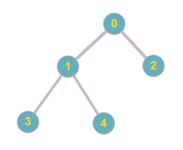
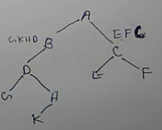

<br>
**Postorder:** 3, 4, 1, 2, 0<br>
**Inorder:** 3, 1, 4, 0, 2<br>
**Preorder:** 0, 1, 3, 4, 2<br>

```c++
void print(struct Node* node)
{
    if (node == NULL)
        return;
    //Postorder
    print(node->left);
    print(node->right);
    cout << node->data << " ";
    //Inorder
    print(node->left);
    cout << node->data << " ";
    print(node->right);
    //Preorder
    cout << node->data << " ";
    print(node->left);
    print(node->right);
}
```

To construct a binary tree we need either 
1) **Preorder + Inorder:**<br>
   ABCDEFCGHJLK, DBFEAGCLJHK

   In preorder left most is the root node. (A)<br>
   Then see it in Inorder (DBFE) left - (GCLJHK) right
   <br>
   Again recursively check left most of DBFE then see it in Inorder. to solve the entire tree.

2) **Postorder + Inorder:**<br>
   Here everything will be simillar as 1) except the rightmost is the root node.

3) **Preorder + Postorder:**<br>
   ABDGHKCEF, GKHDBEFCA
   A is root node, B is left to A<br>
   B in post order has B-EFC-A so B is left EFC is right to A<br>
   <br>